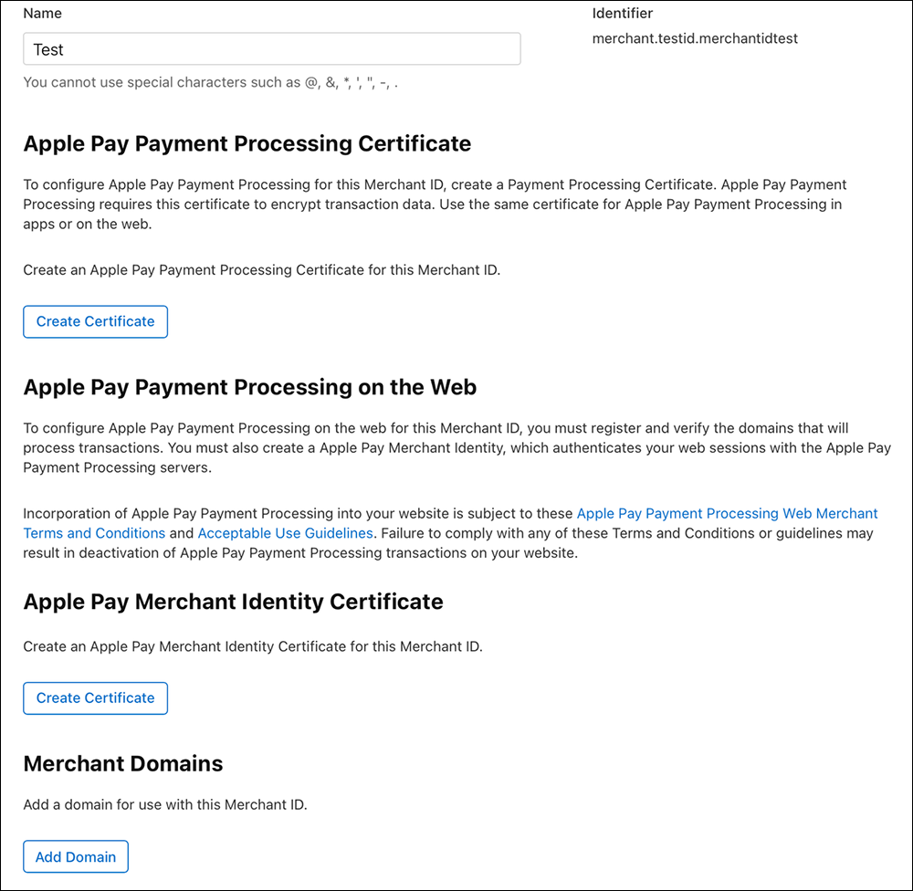

# apple-pay-sdk-go

apple pay server-side golang sdk

1. merchant certificate for get GetPaymentSession from https://apple-pay-gateway.apple.com/paymentservices/paymentSession
2. processing certificate for decrypt `onpaymentauthorized` encrypted payment data

````
# install go mod
go get github.com/jjonline/apple-pay-sdk-go
````

## Apple Pay Setting

* Create Apple Pay Payment Processing Certificate [https://developer.apple.com/help/account/configure-app-capabilities/configure-apple-pay#create-a-payment-processing-certificate](https://developer.apple.com/help/account/configure-app-capabilities/configure-apple-pay#create-a-payment-processing-certificate)
* Create Apple Pay Merchant Identity Certificate [https://developer.apple.com/help/account/configure-app-capabilities/configure-apple-pay-on-the-web#create-a-merchant-identity-certificate)

Assume that downloaded certificate file is `merchant.cer` and `processing.cer`.



1. use Mac app `Keychain Access` open download `Apple Pay Merchant Identity Certificate`, then import it
2. use Mac app `Keychain Access` open download `Apple Pay Payment Processing Certificate`, then import it
3. use Mac app `Keychain Access` export .p12 file containing the private key both of the above

Assume that exported p12 file is `merchant.p12` and `processing.p12`.

## Export private key

```
# Apple Pay Merchant Identity Certificate's KEY
openssl pkcs12 -in merchant.p12 -out merchant.key -nodes -nocerts

# Apple Pay Payment Processing Certificate's KEY
openssl pkcs12 -in processing.p12 -out processing.key -nodes -nocerts
```

## Transfer certificate file format

```
# transfer Apple Pay Merchant Identity Certificate format
openssl x509 -inform der -in merchant.cer -out merchant.pem
# transfer Apple Pay Payment Processing Certificate format
openssl x509 -inform der -in processing.cer -out processing.pem
```

## Payment Processing

> Payment Processing is used to decrypt the token obtained after successful user authorization.

1. Download RootCA: [https://www.apple.com/certificateauthority/AppleRootCA-G3.cer](https://www.apple.com/certificateauthority/AppleRootCA-G3.cer)
2. Transfer to PEM format `openssl x509 -inform der -in AppleRootCA-G3.cer -out AppleRootCA-G3.pem`

````
// init
rootCa, err := os.ReadFile("AppleRootCA-G3.pem")
if err != nil {
    return
}
processingKey, err := os.ReadFile("processing.pem")
if err != nil {
    return
}
processingCert, err := os.ReadFile("processing.key")
if err != nil {
    return
}
process, err := processing.New("your-apple-pay-merchant-id",processingKey,processingCert,rootCa)

// processing decrypt payment token
applePayPayment := ApplePayPayment{} // Should receive the token of successful user authorization and construct this structure
token, err := process.DecryptApplePayPayment(applePayPayment)
````

## Merchant Identity

> function introduce [https://developer.apple.com/documentation/apple_pay_on_the_web/apple_pay_js_api/requesting_an_apple_pay_payment_session](https://developer.apple.com/documentation/apple_pay_on_the_web/apple_pay_js_api/requesting_an_apple_pay_payment_session)

1. Detect which RootCA your Apple Pay Merchant Identity Certificate issued
2. Download RootCA: G1 ~ G8, ref [https://www.apple.com/certificateauthority/](https://www.apple.com/certificateauthority/)
3. Transfer to PEM format `openssl x509 -inform der -in AppleWWDRCAG3.cer -out AppleWWDRCAG3.pem`

````
# detect which RootCA used
openssl x509 -in merchant.cer -text -noout
# you will see like
# Certificate:
#    Data:
#        Version: 3 (0x2)
#        Serial Number:
#            6b:de:40:05:6a:1a:9d:53:00:6c:32:5a:41:95:af:c8
#        Signature Algorithm: sha256WithRSAEncryption
#        Issuer: CN=Apple Worldwide Developer Relations Certification Authority, OU=G3, O=Apple Inc., C=US
````
Notice `Issuer`, than `OU=G3` then RootCA will be [https://www.apple.com/certificateauthority/AppleWWDRCAG3.cer](https://www.apple.com/certificateauthority/AppleWWDRCAG3.cer)

````
// init
rootCa, err := os.ReadFile("AppleWWDRCAG3.pem")
if err != nil {
    return
}
merchantKey, err := os.ReadFile("merchant.pem")
if err != nil {
    return
}
merchantCert, err := os.ReadFile("merchant.key")
if err != nil {
    return
}
merchantIns, err := merchant.New("your-apple-pay-merchant-id",merchantKey,merchantCert,rootCa)

//  Get ApplePayPaymentSession
session, err := merchantIns.GetApplePayPaymentSession("displayName", "web", "your-domain-without-http-prifix")
````
